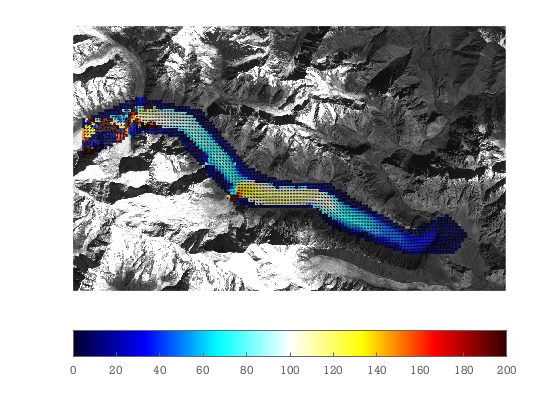

Batura Glacier, Karakoram
==========================================================

CIAS is another free feature tracking software. This is a GUI written in IDL by Kääb & Vollmer. Here we use ImGRAFT to track one of the CIAS example data sets using orthorectified Landsat 7 images from Batura. Here's how you might track it in ImGRAFT.

Note: this example needs the mapping toolbox in order to read the geo-tiffs.

```matlab
datafolder=downloadDemoData('cias');

%%load data
%
%

[A,x,y,Ia]=geoimread(fullfile(datafolder,'batura_2001.tif'));
[B,xb,yb,Ib]=geoimread(fullfile(datafolder,'batura_2002.tif'));
deltax=x(2)-x(1);%m/pixel


%make regular grid of points to track:
[pu,pv]=meshgrid(10:20:size(A,2),10:20:size(A,1)); %pixel coordinated

%obtain corresponding map coordinates of pixel coordinates
px=interp1(x,pu); py=interp1(y,pv);

%... but restricted to points inside this region of interest polygon
roi=[387 452;831 543;1126 899;1343 1006;1657 1022;2188 1330;...
     2437 1220;2564 1359;2483 1473;2188 1489;1693 1320;1563 1181; ...
     1061 1168;663 718;456 686;25 877;28 627;407 465];

mask=inpolygon(pu,pv,roi(:,1),roi(:,2));
pu(~mask)=nan; %inserting nans at some locations will tell template match to skip these locations

[du,dv,C,Cnoise,pu,pv]=templatematch(A,B,pu,pv,'showprogress',{'2001' '2002'});
close all

%visualize the results
%turn the intensity image into an RGB image
%so that it does not interfere with colorbar:

showimg(x,y,A)
hold on
signal2noise=C./Cnoise;
keep=(signal2noise>2)&(C>.6);
V=(du+dv*1i)*deltax; %m/yr
Vn=abs(V);
alphawarp(px,py,Vn,.2+keep*.5)
quiver(px(keep),py(keep),real(V(keep))./Vn(keep),imag(V(keep))./Vn(keep),0.2,'k') %arrows show direction.
caxis([0 200])
colorbar('southoutside');
```


